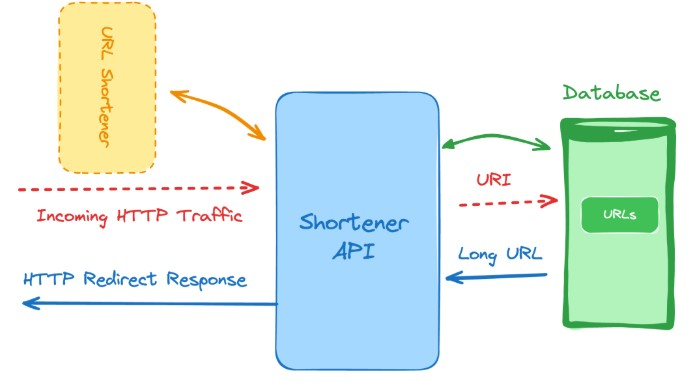

<h1>URL Shortening Service</h1>

<B>Skills and technologies used: Database indexing, HTTP redirects, RESTful endpoints</B>

We’re now moving away from your standard APIs, and tackling URL shortening. This is a very common service, which allows you to shorten very long URLs, especially when looking to share them on social media or make them easily memorable.

For this project idea let’s focus on the following features, which you should be more than capable of implementing on your local environment, no matter your OS.

Ability to pass a long URL as part of the request and get a shorter version of it. You’re free to decide how you’ll perform the shortening .
Save the shorter and longer versions of the URL in the database to be used later during redirection.
Configure a catch-all route on your service that gets all the traffic (no matter the URI used), finds the correct longer version and performs a redirection so the user is seamlessly redirected to the proper destination.